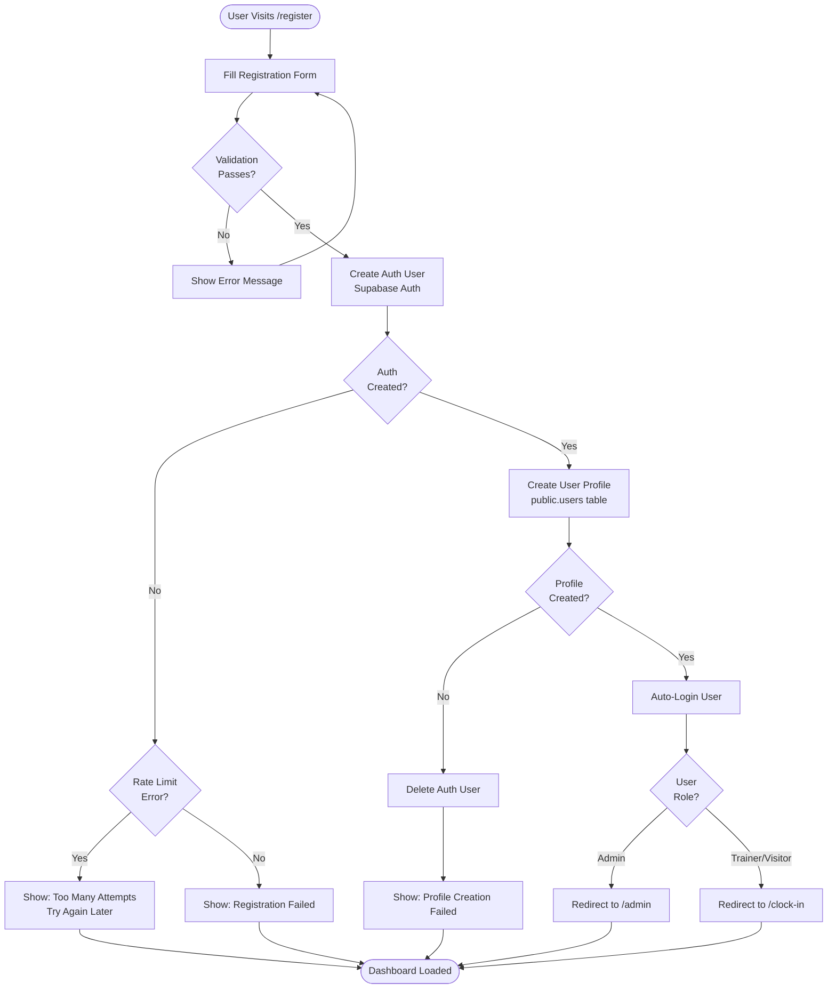
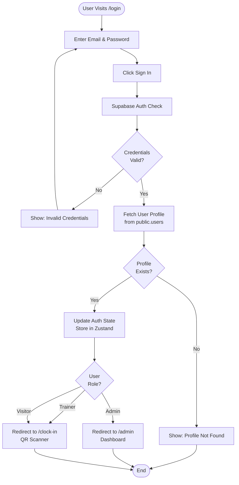
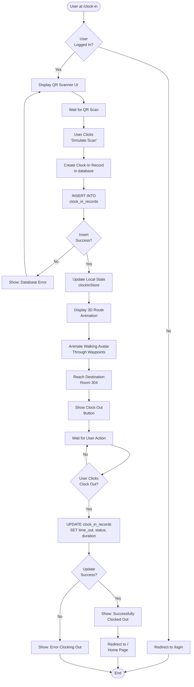
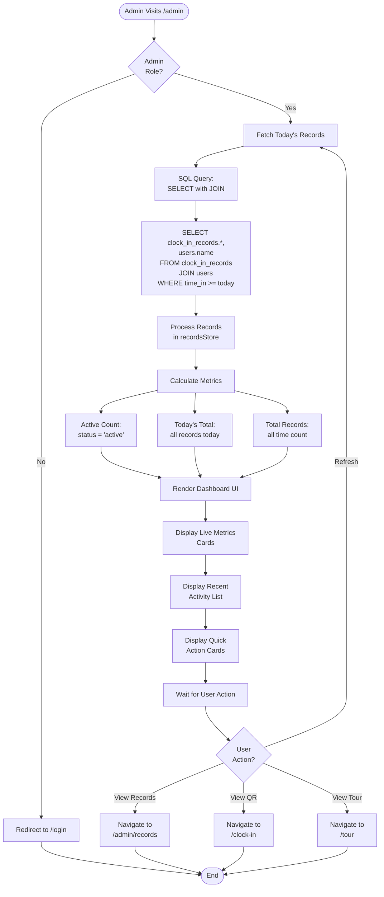
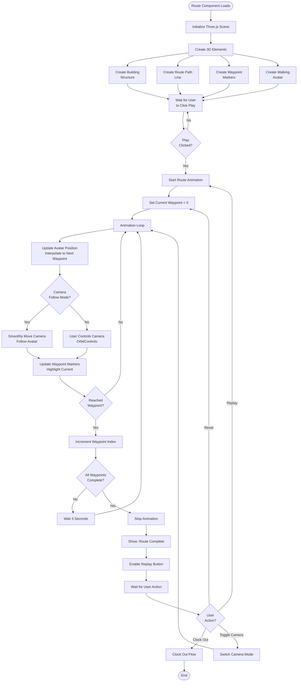

# HYT Wayfinder - Project Summary

## 🎯 Project Overview

**HYT Wayfinder** is a comprehensive 3D Interactive Visitor Management System (VMS) for HYT Global Institute. It combines QR code-based clock-in/out functionality with immersive 3D building navigation and real-time attendance tracking.

## 🏗️ Architecture

### **Tech Stack**
- **Frontend Framework:** Next.js 14 (React 18)
- **3D Engine:** Three.js + React Three Fiber + @react-three/drei
- **Database:** Supabase (PostgreSQL)
- **Authentication:** Supabase Auth
- **State Management:** Zustand with persistence
- **Styling:** Tailwind CSS
- **Language:** TypeScript
- **Deployment:** Ready for Vercel

### **Design System**
- **Color Scheme:** Dark blue (dominant) + Orange (accent)
- **Theme:** Dark mode with glassmorphism effects
- **UI/UX:** Modern, professional, responsive

## 📦 Core Features

### 1. **Authentication System**
- ✅ Login/Register pages with role-based access
- ✅ Supabase Auth integration
- ✅ Three user roles: Admin, Trainer, Visitor
- ✅ Profile management with avatars
- ✅ Session persistence
- ✅ Auto-redirect based on role

### 2. **QR Code Clock-In/Out**
- ✅ Simulated QR scanner with laser animation
- ✅ Mobile and Kiosk view modes
- ✅ Real-time clock-in record creation
- ✅ Auto-calculation of visit duration
- ✅ Database-backed attendance tracking

### 3. **3D Route Navigation**
- ✅ Interactive 3D building visualization
- ✅ 6-waypoint route system (Lobby → Room 304)
- ✅ Animated walking avatar
- ✅ Smooth camera following system
- ✅ Free camera and follow camera modes
- ✅ Glowing path visualization
- ✅ Building structure with elevator and rooms

### 4. **Admin Dashboard**
- ✅ Live metrics (active count, today's total)
- ✅ Real-time clock-in statistics
- ✅ Recent activity feed
- ✅ Quick action cards
- ✅ Records management

### 5. **Records Management**
- ✅ Full clock-in/out history
- ✅ Search and filter functionality
- ✅ User name display via database join
- ✅ Status indicators (active/completed)
- ✅ Time tracking with duration calculation

### 6. **3D Building Tour**
- ✅ First-person controls
- ✅ Multi-floor exploration
- ✅ Interactive building model
- ✅ Performance optimized

## 🗄️ Database Schema

### **Tables**

#### `public.users` (User Profiles)
```sql
- id: uuid (FK → auth.users.id)
- email: text (UNIQUE)
- name: text
- role: text (admin|trainer|visitor)
- avatar: text
- created_at: timestamptz
- updated_at: timestamptz
```

#### `public.clock_in_records` (Attendance)
```sql
- id: uuid
- user_id: uuid (FK → users.id)
- destination: text
- building: text
- room: text
- time_in: timestamptz
- time_out: timestamptz (nullable)
- status: text (active|completed)
- duration: text (calculated)
- schedule_id: uuid (FK → schedules.id)
- created_at: timestamptz
- updated_at: timestamptz
```

#### `public.schedules` (Pre-scheduled Visits)
```sql
- id: uuid
- user_id: uuid (FK → users.id)
- destination: text
- building: text
- room: text
- scheduled_start: timestamptz
- scheduled_end: timestamptz
- status: text (scheduled|in_progress|completed|cancelled)
- notes: text
- created_at: timestamptz
- updated_at: timestamptz
```

### **Relationships**
```
auth.users (Supabase Auth)
    ↓ (1:1)
public.users (Profiles)
    ↓ (1:many)
    ├─ clock_in_records (Attendance)
    └─ schedules (Pre-scheduled)
         ↓ (1:1)
    clock_in_records (Optional link)
```

### **Security**
- ✅ Row Level Security (RLS) enabled on all tables
- ✅ Users can only view their own data
- ✅ Admins have full read access
- ✅ Foreign key constraints with CASCADE
- ✅ Auto-updating timestamps via triggers

## 📁 Project Structure

```
hyt-wayfinder/
├── app/
│   ├── admin/
│   │   ├── page.tsx              # Admin dashboard
│   │   └── records/page.tsx      # Records management
│   ├── clock-in/page.tsx         # QR scanner page
│   ├── login/page.tsx            # Login page
│   ├── register/page.tsx         # Registration page
│   ├── tour/page.tsx             # 3D building tour
│   ├── globals.css               # Global styles
│   └── layout.tsx                # Root layout
├── components/
│   ├── Building.tsx              # 3D building model
│   ├── Camera.tsx                # Camera controls
│   ├── Controls.tsx              # UI controls
│   ├── FloorIndicator.tsx        # Floor display
│   ├── LoadingScreen.tsx         # Loading state
│   ├── PerformanceStats.tsx      # FPS counter
│   ├── Scene.tsx                 # 3D scene setup
│   ├── QRScanner.tsx             # QR scanning UI
│   ├── RouteVisualization.tsx    # 3D route navigation
│   ├── KioskStationView.tsx      # Kiosk display
│   ├── StudentMobileView.tsx     # Mobile view
│   ├── ViewModeSwitcher.tsx      # View toggle
│   └── UserProfile.tsx           # User dropdown
├── store/
│   ├── authStore.ts              # Authentication state
│   ├── recordsStore.ts           # Records management
│   └── clockInStore.ts           # Clock-in state
├── lib/
│   └── supabase.ts               # Supabase client + types
├── hooks/
│   ├── useFirstPersonControls.ts # FPS controls
│   └── useMobileControls.ts      # Touch controls
├── public/
│   └── hyt_logo.png              # HYT logo
└── Documentation/
    ├── SUPABASE_DATABASE_SETUP.md  # SQL setup guide
    ├── REGISTRATION_GUIDE.md        # Auth guide
    ├── DATABASE_SCHEMA_SUMMARY.md   # Schema docs
    ├── 3D_ROUTE_NAVIGATION.md       # 3D feature docs
    ├── QUICK_START.md               # Setup guide
    └── README.md                    # Overview
```

## 🎨 Key Pages & Routes

| Route | Access | Description |
|-------|--------|-------------|
| `/` | Public | Auto-redirects based on auth status |
| `/login` | Public | Login page with demo credentials |
| `/register` | Public | User registration |
| `/admin` | Admin only | Dashboard with live metrics |
| `/admin/records` | Admin only | Full attendance records |
| `/clock-in` | Logged in | QR scanner + 3D route |
| `/tour` | Public | 3D building exploration |

## 🔐 User Roles & Permissions

### **Admin**
- ✅ View all records
- ✅ See live statistics
- ✅ Access admin dashboard
- ✅ View all users
- ✅ Manage schedules

### **Trainer**
- ✅ Clock in/out
- ✅ View own records
- ✅ Access QR scanner
- ✅ See 3D route

### **Visitor**
- ✅ Clock in/out
- ✅ View own records
- ✅ Access QR scanner
- ✅ See 3D route

## 🚀 User Flow

### **New User Registration:**
1. Visit `/register`
2. Fill form (name, email, password, role)
3. Submit → Creates auth user + profile
4. Auto-login → Redirect based on role
   - Admin → `/admin`
   - Trainer/Visitor → `/clock-in`

### **Login Flow:**
1. Visit `/` → Redirects to `/login`
2. Enter credentials
3. Login → Fetch profile from database
4. Redirect based on role

### **Clock-In Flow:**
1. User at `/clock-in`
2. Simulate QR scan
3. Creates record in database
4. Shows 3D route animation
5. Clock out when done

### **Admin Workflow:**
1. Login as admin → `/admin` dashboard
2. View live metrics (active users, today's total)
3. Click "View All Records" → `/admin/records`
4. Search/filter records
5. See user names, times, durations

## 🔧 Configuration

### **Environment Variables**
```env
NEXT_PUBLIC_SUPABASE_URL=https://qdakobfrrkntpzuvmxqv.supabase.co
NEXT_PUBLIC_SUPABASE_ANON_KEY=<your-anon-key>
```

### **Demo Users**
- **Admin:** admin@hyt.com / admin123
- **Trainer:** trainer@hyt.com / trainer123
- **Visitor:** visitor@hyt.com / visitor123

## 🎯 3D Features

### **Route Navigation**
- 6 waypoints: Main Lobby → Hallway A → Elevator → 3rd Floor → Corridor B → Room 304
- Walking avatar with bobbing animation
- Smooth camera interpolation
- Glowing path line
- Waypoint markers with effects
- Building structure with walls and elevator

### **Controls**
- **Play/Pause** - Start/stop route animation
- **Reset** - Return to beginning
- **Camera Toggle** - Switch between follow and free camera
- **Clock Out** - End session

### **Visual Effects**
- Pulsing glow rings on active waypoint
- Vertical light beam
- Animated path line
- Direction arrows on floor
- Golden destination marker

## 📊 Key Metrics Tracked

- **Active Clock-Ins** - Real-time count
- **Today's Total** - Daily attendance
- **Total Records** - All-time count
- **Individual Duration** - Per visit
- **User Activity** - Per person history

## 🏛️ Data Architecture

### **System Architecture Diagram**

```
┌─────────────────────────────────────────────────────────────────┐
│                         CLIENT LAYER                             │
├─────────────────────────────────────────────────────────────────┤
│  Next.js 14 (React 18) - Server-Side Rendered                   │
│  ┌────────────┬────────────┬────────────┬──────────────┐       │
│  │   Pages    │ Components │   Store    │    Hooks     │       │
│  │            │            │  (Zustand) │              │       │
│  │  /login    │  QRScanner │  authStore │ useFirstPer- │       │
│  │  /register │  Route3D   │  records   │ sonControls  │       │
│  │  /admin    │  Building  │  clockIn   │ useMobile-   │       │
│  │  /clock-in │  Scene     │            │ Controls     │       │
│  └────────────┴────────────┴────────────┴──────────────┘       │
└─────────────────────────────────────────────────────────────────┘
                              ↓ ↑
                    Supabase Client SDK
                              ↓ ↑
┌─────────────────────────────────────────────────────────────────┐
│                      SUPABASE LAYER                              │
├─────────────────────────────────────────────────────────────────┤
│  ┌──────────────────┐  ┌──────────────────┐                    │
│  │  Auth Service    │  │  Database API    │                    │
│  │                  │  │   (PostgREST)    │                    │
│  │  - signUp        │  │  - RESTful API   │                    │
│  │  - signIn        │  │  - Auto-gen API  │                    │
│  │  - signOut       │  │  - Row Level     │                    │
│  │  - getSession    │  │    Security      │                    │
│  └──────────────────┘  └──────────────────┘                    │
│                              ↓ ↑                                 │
│  ┌──────────────────────────────────────────────────────────┐  │
│  │              PostgreSQL Database                          │  │
│  │  ┌─────────────────────────────────────────────────────┐ │  │
│  │  │  auth.users (Managed by Supabase)                   │ │  │
│  │  │  - id (PK)                                           │ │  │
│  │  │  - email, encrypted_password, etc.                  │ │  │
│  │  └─────────────────────────────────────────────────────┘ │  │
│  │           │                                                │  │
│  │           │ (FK) 1:1                                      │  │
│  │           ↓                                                │  │
│  │  ┌─────────────────────────────────────────────────────┐ │  │
│  │  │  public.users (Your Profiles)                       │ │  │
│  │  │  - id (PK, FK → auth.users.id)                      │ │  │
│  │  │  - email, name, role, avatar                        │ │  │
│  │  └─────────────────────────────────────────────────────┘ │  │
│  │           │                                                │  │
│  │           │ 1:many                                        │  │
│  │           ↓                                                │  │
│  │  ┌────────────────────────┬───────────────────────────┐  │  │
│  │  │ public.clock_in_records│   public.schedules        │  │  │
│  │  │ - id (PK)              │   - id (PK)               │  │  │
│  │  │ - user_id (FK)         │   - user_id (FK)          │  │  │
│  │  │ - destination          │   - destination           │  │  │
│  │  │ - time_in, time_out    │   - scheduled_start/end   │  │  │
│  │  │ - schedule_id (FK) ────┼──→ - status, notes        │  │  │
│  │  └────────────────────────┴───────────────────────────┘  │  │
│  └──────────────────────────────────────────────────────────┘  │
└─────────────────────────────────────────────────────────────────┘
```

### **Entity Relationship Diagram (ERD)**

```
┌──────────────────────┐
│    auth.users        │
│  (Supabase Auth)     │
├──────────────────────┤
│ • id (PK)            │
│   email              │
│   encrypted_password │
│   created_at         │
└──────────┬───────────┘
           │
           │ 1:1 (CASCADE)
           │
           ↓
┌──────────────────────┐
│   public.users       │
│  (User Profiles)     │
├──────────────────────┤
│ • id (PK, FK)        │◄──────┐
│   email (UNIQUE)     │       │
│   name               │       │
│   role               │       │
│   avatar             │       │
│   created_at         │       │
│   updated_at         │       │
└──────────┬───────────┘       │
           │                    │
           │ 1:many             │
           │                    │
   ┌───────┴────────┐          │
   ↓                ↓           │
┌──────────────┐  ┌─────────────────┐
│  schedules   │  │ clock_in_records│
├──────────────┤  ├─────────────────┤
│ • id (PK)    │  │ • id (PK)       │
│   user_id ───┼──┘   user_id (FK) │
│   destination│      destination   │
│   building   │      building      │
│   room       │      room          │
│   scheduled_ │      time_in       │
│   start      │      time_out      │
│   scheduled_ │      status        │
│   end        │      duration      │
│   status     │      schedule_id ──┼──┐
│   notes      │      created_at    │  │
│   created_at │      updated_at    │  │
│   updated_at │                    │  │
└──────────────┘  └─────────────────┘  │
       ↑                                 │
       └─────────────────────────────────┘
              1:1 (OPTIONAL)
```

### **Data Flow Architecture**

```
┌─────────────────────────────────────────────────────────────────┐
│                    PRESENTATION LAYER                            │
│  (React Components - UI)                                         │
└──────────────┬──────────────────────────────────┬───────────────┘
               │                                   │
               ↓                                   ↓
┌──────────────────────────────┐    ┌─────────────────────────────┐
│     STATE MANAGEMENT         │    │    3D RENDERING ENGINE      │
│     (Zustand Stores)         │    │    (React Three Fiber)      │
│                              │    │                             │
│  • authStore                 │    │  • Three.js Scene           │
│  • recordsStore              │    │  • Waypoint Markers         │
│  • clockInStore              │    │  • Walking Avatar           │
└──────────┬───────────────────┘    │  • Camera Controls          │
           │                         └─────────────────────────────┘
           │
           ↓
┌─────────────────────────────────────────────────────────────────┐
│                     API LAYER                                    │
│     (Supabase Client - lib/supabase.ts)                         │
│                                                                  │
│  Methods:                                                        │
│  • supabase.auth.signUp()                                       │
│  • supabase.auth.signInWithPassword()                          │
│  • supabase.from('users').select()                             │
│  • supabase.from('clock_in_records').insert()                  │
└──────────┬──────────────────────────────────────────────────────┘
           │
           │ HTTPS / WebSocket
           │
           ↓
┌─────────────────────────────────────────────────────────────────┐
│                 DATABASE LAYER                                   │
│            (Supabase PostgreSQL)                                 │
│                                                                  │
│  Security:                                                       │
│  • Row Level Security (RLS)                                     │
│  • JWT-based authentication                                     │
│  • Policy-based access control                                  │
│                                                                  │
│  Optimization:                                                   │
│  • Indexes on foreign keys                                      │
│  • Automatic timestamp triggers                                 │
│  • Materialized views (future)                                  │
└─────────────────────────────────────────────────────────────────┘
```

## 📈 System Flowcharts

### **1. User Registration Flow**



### **2. Login Flow**



### **3. Clock-In Flow**



### **4. Admin Dashboard Data Flow**



### **5. 3D Route Navigation Flow**



### **6. Data Synchronization Flow**

```mermaid
flowchart TD
    Start([User Action Triggered]) --> ActionType{Action<br/>Type?}
    
    ActionType -->|Create| CreateFlow[Create Flow]
    ActionType -->|Read| ReadFlow[Read Flow]
    ActionType -->|Update| UpdateFlow[Update Flow]
    ActionType -->|Delete| DeleteFlow[Delete Flow]
    
    CreateFlow --> LocalCreate[Update Local State<br/>Zustand Store]
    LocalCreate --> APICreate[API Call:<br/>supabase.insert()]
    APICreate --> CreateDB[Database INSERT]
    CreateDB --> CreateSuccess{Success?}
    
    CreateSuccess -->|No| RollbackCreate[Rollback Local State]
    RollbackCreate --> ShowError1[Show Error]
    
    CreateSuccess -->|Yes| UpdateUI1[Update UI<br/>Show Success]
    UpdateUI1 --> End([End])
    
    ReadFlow --> CheckCache{Data in<br/>State?}
    CheckCache -->|Yes| ReturnCache[Return Cached Data]
    CheckCache -->|No| APIRead[API Call:<br/>supabase.select()]
    
    APIRead --> ReadDB[Database SELECT<br/>with JOIN]
    ReadDB --> ReadSuccess{Success?}
    
    ReadSuccess -->|No| ShowError2[Show Error]
    ReadSuccess -->|Yes| CacheData[Cache in Zustand]
    CacheData --> ReturnCache
    
    ReturnCache --> End
    
    UpdateFlow --> LocalUpdate[Optimistic Update<br/>Local State]
    LocalUpdate --> APIUpdate[API Call:<br/>supabase.update()]
    APIUpdate --> UpdateDB[Database UPDATE]
    UpdateDB --> UpdateSuccess{Success?}
    
    UpdateSuccess -->|No| RollbackUpdate[Rollback Local State]
    RollbackUpdate --> ShowError3[Show Error]
    
    UpdateSuccess -->|Yes| UpdateUI2[Update UI<br/>Show Success]
    UpdateUI2 --> End
    
    DeleteFlow --> LocalDelete[Mark as Deleted<br/>Local State]
    LocalDelete --> APIDelete[API Call:<br/>supabase.delete()]
    APIDelete --> DeleteDB[Database DELETE<br/>CASCADE]
    DeleteDB --> DeleteSuccess{Success?}
    
    DeleteSuccess -->|No| RollbackDelete[Rollback Local State]
    RollbackDelete --> ShowError4[Show Error]
    
    DeleteSuccess -->|Yes| RemoveUI[Remove from UI]
    RemoveUI --> End
    
    ShowError1 --> End
    ShowError2 --> End
    ShowError3 --> End
    ShowError4 --> End
```

## 📊 Key Metrics Tracked

- **Active Clock-Ins** - Real-time count
- **Today's Total** - Daily attendance
- **Total Records** - All-time count
- **Individual Duration** - Per visit
- **User Activity** - Per person history

## 🔄 Data Flow

### **Registration**
```
User Input → Supabase Auth → auth.users created
          → Profile created → public.users inserted
          → Auto-login → State updated → Redirect
```

### **Clock-In**
```
QR Scan → Create record → clock_in_records.insert
        → Join with users → Fetch name
        → Display in dashboard
```

### **Admin View**
```
Load dashboard → Fetch records with join
              → SELECT clock_in_records.*, users.name
              → Display with calculations
```

## 🛠️ Development Setup

1. **Clone repo**
2. **Install dependencies:** `npm install`
3. **Set up Supabase:**
   - Create project
   - Run SQL from `SUPABASE_DATABASE_SETUP.md`
   - Get API keys
4. **Configure `.env.local`**
5. **Run dev server:** `npm run dev`
6. **Build:** `npm run build`

## 📈 Future Enhancements

- 🔄 Real QR code scanning (replace simulation)
- 📱 Progressive Web App (PWA)
- 🔔 Push notifications
- 📊 Analytics dashboard
- 📅 Advanced scheduling system
- 🗺️ Multiple routes for different destinations
- 🌐 Multi-language support
- 📸 User photo capture on clock-in
- 📧 Email confirmations
- 📱 Mobile app (React Native)

## 🐛 Known Issues

- ⚠️ Registration rate limit (429) - Use demo users for testing
- ⚠️ Email confirmation disabled for development
- ⚠️ QR scanning is simulated (not real camera)

## 📝 Documentation Files

- `README.md` - Project overview
- `SUPABASE_DATABASE_SETUP.md` - Complete database setup with SQL
- `REGISTRATION_GUIDE.md` - Auth troubleshooting
- `DATABASE_SCHEMA_SUMMARY.md` - Schema details
- `3D_ROUTE_NAVIGATION.md` - 3D feature documentation
- `QUICK_START.md` - Fast setup guide

## 🎓 Technologies Used

- **Next.js 14** - React framework
- **TypeScript** - Type safety
- **Supabase** - Backend as a Service
- **Three.js** - 3D graphics
- **React Three Fiber** - React renderer for Three.js
- **Zustand** - State management
- **Tailwind CSS** - Styling
- **Font Awesome** - Icons
- **react-qr-code** - QR code generation

## 📞 Support

For issues or questions, refer to:
- `QUICK_START.md` for setup
- `REGISTRATION_GUIDE.md` for auth issues
- `SUPABASE_DATABASE_SETUP.md` for database setup

---

**Project Status:** ✅ Production Ready  
**Build Status:** ✅ Passing  
**Database:** ✅ Configured  
**Authentication:** ✅ Working  
**3D Features:** ✅ Complete  

**Last Updated:** December 2024
